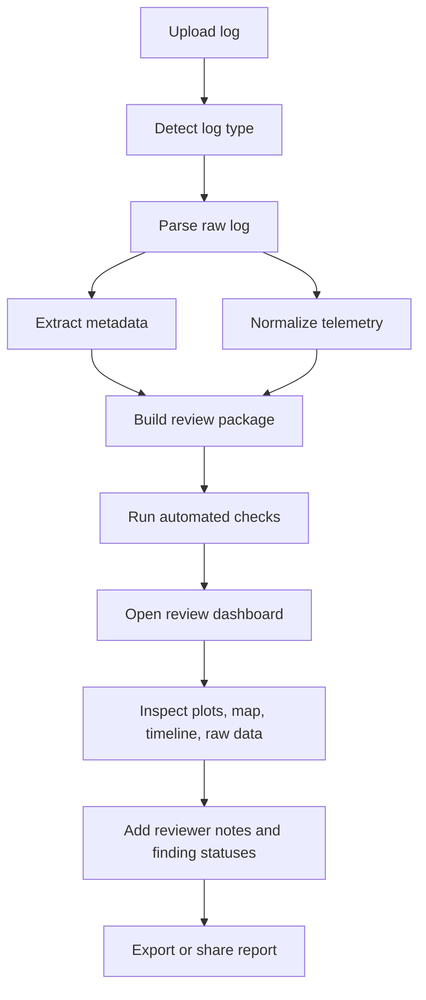
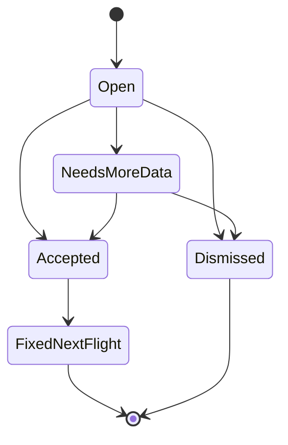

# Core Workflow

## Primary User Flow

## Review States

- `uploaded`: file received and basic validation passed.
- `parsing`: parser is reading raw log data.
- `normalized`: common telemetry schema has been produced.
- `analyzed`: automated checks and metrics are complete.
- `reviewing`: user is inspecting and adding notes.
- `published`: report has been exported or shared.
- `failed`: parsing or analysis failed with a visible diagnostic.

## Review Page Layout

1. Header
   - Flight name, log type, vehicle, firmware, date/time, duration, health score.
2. Alert strip
   - Critical findings, warnings, missing data, parse limitations.
3. 2D/3D route and timeline
   - 2D route map for quick plan-view review.
   - Cesium 3D map path, mode-colored flight segments, altitude, events,
     arm/disarm, failsafes.
   - Hover/click route inspection for speed, altitude, coordinates, mode,
     battery, GPS quality, and nearby events.
4. Plot workspace
   - Sync zoom/crosshair across plots.
   - Mode-colored background.
   - Preset tabs for major engineering systems.
5. Findings panel
   - Severity, confidence, evidence, time range, recommendation, reviewer
     status.
6. Raw data panel
   - Topic/field browser, search, table, CSV export.
7. Report panel
   - Reviewer notes, conclusion, export, share.

## Finding Lifecycle

## Minimum Review Checklist

- Flight metadata parsed correctly.
- Route and duration look plausible.
- Cesium path aligns with expected operating area, altitude, and mode sequence.
- 2D path aligns with expected mission shape, waypoint path, and geofence area.
- Hover inspection shows plausible speed, altitude, location, and mode at
  selected points.
- Mode sequence is complete.
- No unexplained logging dropouts.
- GPS quality acceptable for mission type.
- Estimator health acceptable.
- Vibration within safe range.
- Power did not sag below threshold.
- Control tracking does not show saturation or oscillation.
- Failsafe or warning messages are reviewed.
- Findings have evidence and reviewer disposition.
